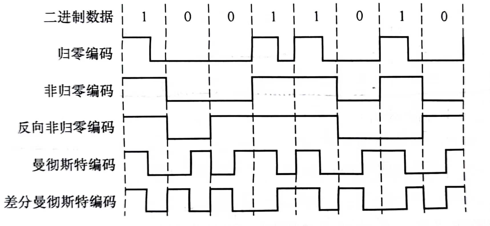

## 数据链路层

## 1.功能
### 1.为网络层提供服务

- 无确认的无连接服务
- 有确认的无连接服务
- 有确认的面向连接服务
**有连接就一定要确认**

### 2.链路管理
数据链路层的连接的`建立`，`维持`和`释放`过程称为`链路管理`

链路两端结点通信前必须确认对方已处于`就绪状态`，这个过程称为`链路建立`

### 3.帧定界，帧同步与透明传输
- 帧长=数据长度+首部/尾部长度，作用是帧定界
- 帧同步：帧定界后，接收方要能够识别出帧的边界
- 透明传输：无论传输的数据是什么样的比特组合，都应当能在链路上传送。
### 4.流量控制
限制发送方的发送速率，使接收方能够及时处理接收到的数据，防止接收方的缓冲区溢出。
>OSI模型中数据链路层有流量控制功能，但是TCP/IP模型中流量控制功能被转移到了传输层。

### 5.差错控制

## 2.组帧
### 1.字符计数法
- 帧头部使用一个计数字段表明帧内字符数。
- 如果计数字段出错，即失去了帧边界划分的依据，收发双方将`失去同步`。

### 2.字符填充法
- 在帧头部和帧尾部填充一些特殊字符，作为帧的边界标志。
- 插入转义字符来转义非首尾的特殊字符。

### 3.零比特填充法
- 使用一个特定的比特模式，即`01111110`，作为帧的边界标志。
- 为了防止错误，在收到五个连续的1后自动插入一个0。

### 4.违规编码法
- 采用违规编码法
- 无需任何填充技术，便能实现数据传输的透明性，但只适用冗余编码的特殊编码环境。

## 3.差错控制
### 1.检错编码
#### 1.奇偶校验码
- 奇校验码：附加校验码后，数据位中1的个数为奇数
- 偶校验码：附加校验码后，数据位中1的个数为偶数

#### 2.循环冗余校验码(CRC)
- 生成多项式，阶数为r
- 数据的低位端加上r个0
- 数据与多项式相除(异或运算)，余数作为`帧检测序列(FCS)`替代末r位0
- `不可靠传输`：差错的帧直接丢弃

### 2.纠错编码
#### 海明码
`n`表示有效信息位数，`k`为校验位的位数，则信息位`n`和校验位`k`应该满足

$n+k+1\leq2^{k}$

校验位置于 $2^{k}$ 位上

校验位的值为所有使用该校验位的值的`异或`结果。

## 4.流量控制与可靠传输系统

### 1.流量控制、可靠传输与滑动窗口机制
#### 1.停止-等待流量控制基本原理
- 发送方发送一帧，等待接收方应答信号
- 接收方接收一帧，反馈一个应答信号
- 每次只能一帧，`传输效率低`

#### 2.滑动窗口流量控制基本原理
- 发送方维持一组连续的允许发送的帧的序号，称为`发送窗口`
- 接收方维持一组连续的允许接收的帧的序号，称为`接收窗口`
- 发送端每收到一个`确认帧`，发送窗口就向前滑动一个位置。若发送窗口内没有可发送的帧，则停止发送。
- 接收端收到数据帧后，将窗口向前移动一个位置，并发回确认帧。若收到的数据帧落在接收窗口之外，则一律丢弃。

**滑动窗口的特性：**
- 接收窗口向前滑动时，发送窗口才有可能向前滑动
- 滑动窗口的特殊形式
  - `停止-等待协议`：发送窗口大小=1，接收窗口大小=1
  - `后退N帧协议`：发送窗口大小>1，接收窗口大小=1
  - `选择重传协议`：发送窗口大小>1，接收窗口大小>1
- 接收窗口大小为1，可以保证帧`有序接收`
- 数据链路层的滑动窗口协议中，窗口大小在传输过程中`固定`

#### 3.可靠传输机制
- `确认`：无数据的控制帧，使得接收方可以让发送方知道哪些内容被正确接受。
  - 有些情况下为了提高效率，将确认捎带在一个回复帧中，称为`稍待确认`
- `超时重传`：发送方在发送某个数据帧后开始一个计时器，若一定时间内没收到发送的数据帧的确认帧，就重新发送该数据帧，直到发送成功为止
- `自动重传请求(ARQ)`：接收方请求发送方重传出错的数据帧来恢复出错的帧。

### 2.单帧滑动窗口与停止-等待协议
- 可能出现的问题
  - 数据帧丢失
  - 到达目的站的帧已遭破坏：超时重传
  - 数据帧正确但确认帧破坏
    - 出现相同发送序号的数据帧，表明发送端进行了超时重传
    - 连续出现相同序号的确认帧，表明接收端收到了重复帧

### 3.多帧滑动窗口与后退N帧协议(GBN)
- 接收方只允许按顺序接收帧
- 接收方对某一数据帧的确认表明该数据帧和`此前所有数据帧`均已正确无误地收到。
- 若采取n比特对帧编号，那么发送窗口地尺寸 $W_{T}$ 应满足 $1\leq W_{T}\leq2^{n}-1$

### 4.多帧滑动窗口与选择重传协议(SR)
- 为了提高信道利用率，可以设法只重传出现差错的数据帧或计时器超时的数据帧。这就需要`加大接收窗口`。
- 接收方怀疑出错便发送否定帧`NAK`，要求发送方对NAK中指定的帧重传。
- 接收窗口和发送窗口的大小是相同的，且最大值都是序号范围的一半。
- 若采取n比特对帧编号，那么发送窗口和接收窗口的尺寸满足 $W_{Tmax}=W_{Rmax}=2^{n-1}$
- 选择重传协议可以`避免重复传输`已经正确到达接收端的数据帧，但接收端要设置具有相当容量的`缓冲区`暂存那些未按序正确收到的帧。

## 5.介质访问控制
>(这一章有好多东西，但是上课好像只在讲局域网的时候提到了`CSMA/CD`，所以之后优先更新这个，有时间再更新`ALOHA`和`CSMA`和其他东西)
## 6.局域网
### 1 概念和体系结构
**`局域网`**: 较小地理范围内的计算机互联网络。

主要特点：
- 为一个单位所有，`地理范围`和`站点数目`有限
- 所有站点共享`较高总带宽`
- `较低时延`和`较低误码率`
- 各站为`平等关系`而非`主从关系`
- 能进行`广播`和`组播`

三个要素：拓扑结构，传输介质，`介质访问控制方式`，后者决定局域网技术特性。

- 拓扑分类：星形，总线型，环形，复合型
- 传输介质：双绞线，同轴电缆，光纤等，`双绞线`为主流方式
- 介质访问控制方式：`CSMA/CD`

特殊的局域网拓扑实现：
- 以太网(使用范围最广)，逻辑拓扑总线型，物理拓扑星形/拓展星形
- 令牌环(IEEE 802.5)，逻辑拓扑环形，物理拓扑星形
- FDDI 光纤分布数字接口(IEEE 802.8)，逻辑拓扑环形，物理拓扑双环

IEEE 802定义的局域网参考模型对应OSI模型的`数据链路层`和`物理层`，并将数据链路层拆分为`逻辑链路控制(LLC)`和`媒体接入控制(MAC)`
- MAC子层：屏蔽对`物理层`访问的各种差异，功能包括组帧，拆卸帧，比特传输差错检测，透明传输
- LLC子层：向`网络层`提供无确认无连接，面向连接，确认无连接，高速传输四种服务类型

### 2.以太网与IEEE 802.3

以太网逻辑上用`总线形拓扑结构`，所有计算机共享一条总线，信息以`广播`形式发送，使用`CSMA/CD`对总线进行访问控制。通常将`802.3局域网`简称`以太网`

简化通信：
- 无连接工作方式，不对发送的数据帧编号，不需要接收方确认，即以太网`尽最大努力交付数据`，提供`不可靠服务`，对差错的纠正由高层完成。
- 发送的数据使用`曼彻斯特编码`，每个码元中间出现一次电压转换，接收端利用这种电压转换方便把位同步信号提取出来。

<b>曼彻斯特编码复习</b>

#### 1.以太网的传输介质和网卡

#### 2.以太网的MAC帧
网卡中的MAC地址称为`物理地址`，以太网中的MAC地址为`48位`，前24位为`厂商代码`，后24位为`厂商自定义`，`全球唯一`。

以太网的MAC帧格式：
- 前导码：使得接收端和发送端`时钟同步`，8字节。
  - 前同步码：7字节，实现MAC帧的比特同步
  - 帧开始界定符：1字节，标识MAC帧的开始
- 目的地址：6字节，目的主机的MAC地址
- 源地址：6字节，源主机的MAC地址
- 类型：2字节，指出数据域中携带的数据应交给哪个协议实体处理
- 数据：46-1500字节，数据域中的数据，包含`高层协议信息`，由于`CSMA/CD`算法限制，以太网帧必须满足最小长度`64字节`，数据较少时需要填充
- 填充：0-46字节，填充帧，使之达到64字节最小长度。
- 校验码(FCS)：4字节，用于检测帧中的差错，由`CRC-32`算法生成。
> 由CSMA/CD算法限制，以太网帧必须满足最小长度`64B`，而MAC帧首部和尾部的长度为`18B`，因此数据域的最小长度为`64-18=46B`。最大长度`1500B`是IEEE 802.3数据段的最大字节数。

#### 3.高速以太网
速度达到`100Mb/s`的以太网称为`高速以太网`，包括100BASE-T，千兆以太网等。

